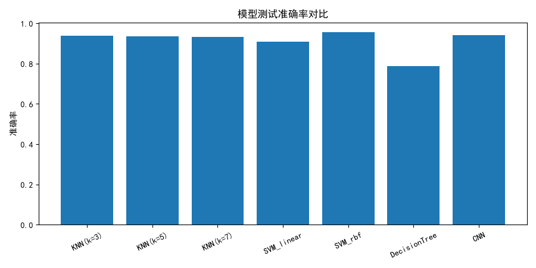
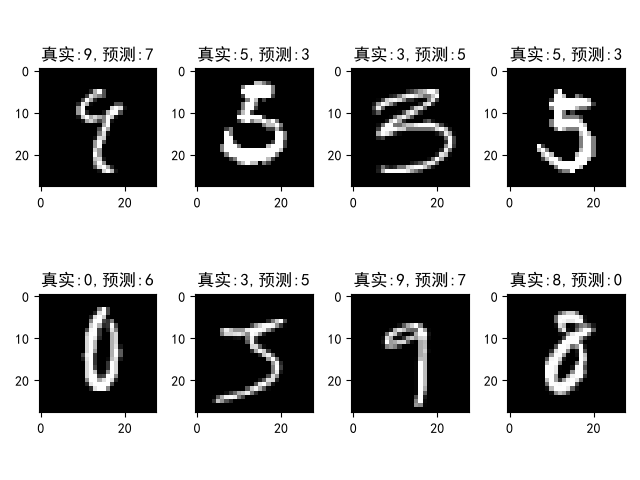

# 基于 MNIST 数据集完成多模型手写数字识别
  对比传统机器学习与神经网络在手写数字识别上的效果

## 项目说明
  本项目基于MNIST手写数字数据集完成多模型对比实验。MNIST数据集包含大量手写0‑9数字灰度图片，原始数据集样本量较大，为了缩短训练调试时间，实验选取部分子集开展训练与测试。
  实现模型包括K近邻(KNN)、支持向量机(SVM)、决策树、全连接神经网络。
  在代码实现过程中，我首先完成数据集加载、划分；依次实现多种传统机器学习模型，观察不同超参数对识别准确率的影响；之后搭建简单全连接神经网络，对比传统机器学习方法与神经网络的性能差异。
  实验不仅统计各个模型在测试集上的准确率，还对SVM‑rbf模型预测错误的样本进行可视化，观察容易混淆的手写数字样本，分析模型失败的案例。

## 实验结果

